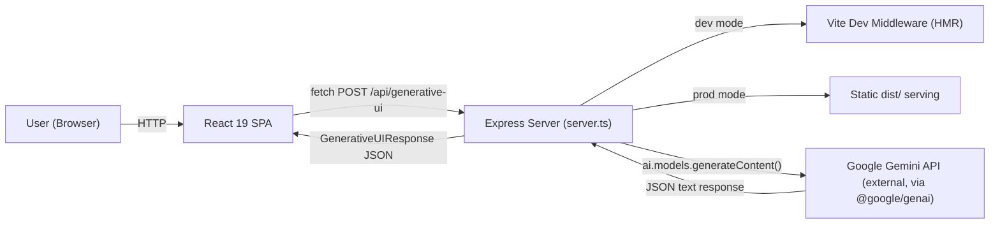
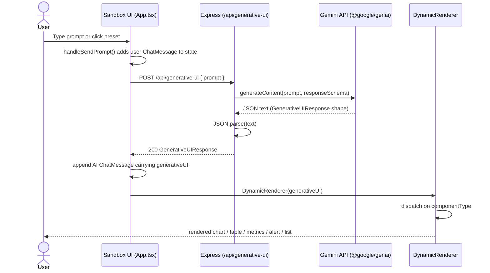
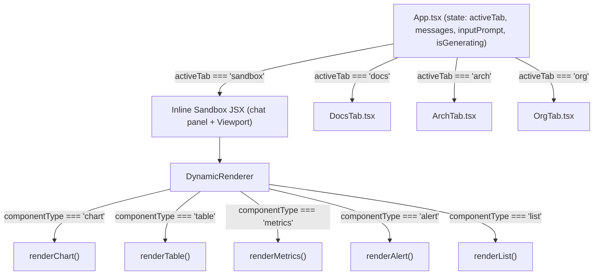
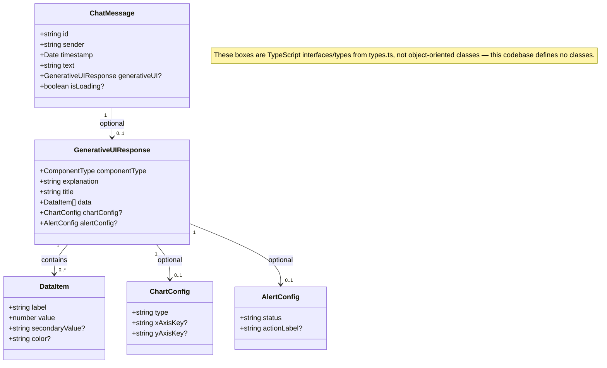
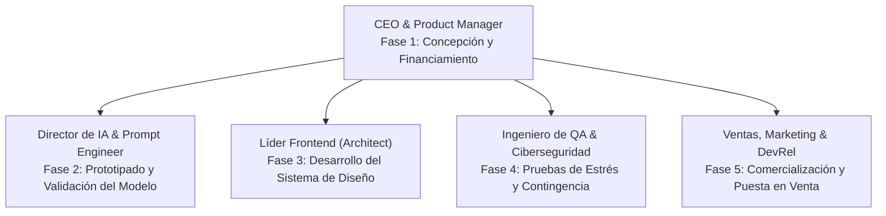

# Generative UI Architect

A demo app that lets a user describe a request in natural language and dynamically renders the right UI component (chart, table, metrics, alert, or list) using a Gemini-backed backend.

## Table of Contents

- [Live Demo](#live-demo)
- [Overview](#overview)
- [Prerequisites](#prerequisites)
- [Setup](#setup)
- [Available Scripts](#available-scripts)
- [Project Structure](#project-structure)
- [Diagrams](#diagrams)
- [Features](#features)
- [API Contract: POST /api/generative-ui](#api-contract-post-apigenerative-ui)
- [Known Gaps](#known-gaps)

## Live Demo

A static build of this app is deployed to GitHub Pages: **https://fer336.github.io/generative-ui-architect/**

GitHub Pages only serves static files — it cannot host the Express server (`server.ts`) or keep `GEMINI_API_KEY` secret. So the Pages deployment runs entirely on **canned/mock sample data** instead of live Gemini calls (see `src/mockResponses.ts`); a visible banner in the UI makes this clear so nobody mistakes it for a live AI backend. For the real experience — actual Gemini-backed generation — run the app locally following the [Setup](#setup) section below.

## Overview

Generative UI Architect is a React 19 + Vite 6 + Express + TypeScript single-page app that demonstrates the "Generative UI" pattern: a user prompt is sent to a Gemini 3.5 Flash backend, which returns structured JSON, which the frontend then renders dynamically as a chart, table, metrics dashboard, alert, or list — no fixed layout per query.

This project originated from a Google AI Studio scaffold. The `package.json` name (`react-example`) and the `index.html` `<title>` (`My Google AI Studio App`) were never rebranded; see [Known Gaps](#known-gaps).

## Prerequisites

- Node.js 22 or later (inferred from `@types/node: ^22.14.0` in `package.json`)
- A `GEMINI_API_KEY` — obtain one from Google AI Studio

## Setup

1. Get the project files onto your machine. (This repository is not yet git-initialized — there is no `.git` clone URL to reference; copy or download the files instead.)
2. Install dependencies:
   ```
   npm install
   ```
3. Copy the environment template:
   ```
   cp .env.example .env
   ```
4. Open `.env` and set `GEMINI_API_KEY` to your Gemini API key. (`.env.example` may list additional variables — inspect it directly, as only `GEMINI_API_KEY` is confirmed as required by the code in this README.)
5. Start the dev server:
   ```
   npm run dev
   ```
   The app listens on `http://localhost:3000` by default.

## Available Scripts

| Script | Command | Description |
|---|---|---|
| `dev` | `tsx server.ts` | Runs the Express + Vite middleware dev server with hot module reload. |
| `build` | `vite build && esbuild server.ts --bundle --platform=node --format=cjs --packages=external --sourcemap --outfile=dist/server.cjs` | Builds the frontend bundle with Vite and bundles the server into `dist/server.cjs`. |
| `start` | `node dist/server.cjs` | Runs the production build (requires `npm run build` first). |
| `clean` | `rm -rf dist server.js` | Removes build output. |
| `lint` | `tsc --noEmit` | Runs a TypeScript **typecheck only** — this is not ESLint, and no ESLint configuration exists in this project. |

## Project Structure

```
index.html                          # Entry HTML; loads src/main.tsx
server.ts                           # Express server + /api/generative-ui endpoint + Vite middleware/static serving
vite.config.ts                      # Vite config (React, Tailwind, HMR toggle via DISABLE_HMR)
src/
  main.tsx                          # React root mount
  types.ts                          # Shared TypeScript types, incl. the API response contract
  App.tsx                           # Tab navigation + sandbox chat UI + fetch logic for /api/generative-ui
  components/
    DynamicRenderer.tsx             # Renders chart/table/metrics/alert/list from GenerativeUIResponse
    DocsTab.tsx                     # "¿Qué es Generative UI?" conceptual/explainer content
    ArchTab.tsx                     # Interactive architecture diagram
    OrgTab.tsx                      # Org chart + roadmap / commercialization pitch content
```

`src/types.ts` and `server.ts` are the source of truth for the exact request/response shape — see [API Contract](#api-contract-post-apigenerative-ui) below.

## Diagrams

The diagrams below are rendered with GitHub-native Mermaid fenced code blocks. They are derived directly from the source (`types.ts`, `App.tsx`, `server.ts`, `DynamicRenderer.tsx`, `OrgTab.tsx`) — no services, classes, or data stores beyond what is actually implemented are shown.

### Software Architecture

The runtime is a single Express process that either proxies to Vite's dev middleware or serves the built static bundle, plus one outbound call to the Gemini API. There is no database, queue, or additional backend service.



### Sequence Diagram

This traces one full request: a user prompt in the Sandbox tab through Express and Gemini, back to `DynamicRenderer`.



### Component Diagram

`App.tsx` owns all state and switches between four tabs; only the Sandbox tab uses `DynamicRenderer`, which internally dispatches to one of five render functions based on `componentType`. `DocsTab`, `ArchTab`, and `OrgTab` are self-contained and take no props.



### Type/Interface Relationships

This codebase has no classes — everything is functional components and hooks — so a UML class diagram in the strict OO sense doesn't apply. The block below uses Mermaid's `classDiagram` syntax purely to express the shape and containment relationships between the TypeScript interfaces/types in `types.ts`; read every box as a `type`/`interface`, not an instantiable class.



### Entity-Relationship

Not applicable — omitted intentionally. There is no persistence layer anywhere in this codebase: no database, ORM, or schema/migration files exist (confirmed via `package.json` and the file tree). Every `GenerativeUIResponse` is generated fresh by Gemini per request and held only in React state (`App.tsx`'s `messages` array); nothing survives a page refresh. An ER diagram would misrepresent the app by implying persisted, related tables that don't exist.

### Organizational Chart

This depicts the **fictional pitch-deck org chart** shown inside the app's Org tab (`OrgTab.tsx`) — a hypothetical team for a hypothetical commercialization pitch, not the real team behind this repository. The underlying `OrgNode` data is a flat list keyed by roadmap phase (Fase 1-5) with no parent/child field, so all four specialist roles are shown as direct reports to the CEO rather than inferring a multi-level hierarchy that isn't in the data.



### Design Patterns

- **Discriminated-union rendering dispatch** — `DynamicRenderer` switches on the `componentType` discriminant (`"chart" | "table" | "metrics" | "alert" | "list"`) to pick one of five internal render functions. This is plain conditional dispatch on a TypeScript discriminated union, not a formal GoF Strategy pattern with pluggable strategy objects/classes.
- **Backend-for-Frontend (BFF) / API-key isolation** — `server.ts` proxies every Gemini call so `GEMINI_API_KEY` never reaches the browser; the frontend only ever talks to the app's own `/api/generative-ui` endpoint.
- **Schema-constrained (contract-first) LLM generation** — the Gemini call in `server.ts` passes a `responseSchema` (a `Type.OBJECT` JSON-Schema-like config) so the model's output is constrained to match `GenerativeUIResponse`, instead of relying on prompt instructions alone.
- **Controlled components** — the prompt `<input>` in `App.tsx` is bound via React `value`/`onChange` state, the standard controlled-component pattern.

No classic GoF patterns (Factory, Singleton, Observer, Repository, etc.) are used in this codebase — there are no classes at all, only functional components and hooks, so this list is intentionally limited to what's actually present.

## Features

The app has four tabs, selected from the top navigation bar.

### Laboratorio Interactivo (Demo) — Sandbox

The main working tab. A chat-style left panel lets the user type a free-text prompt or click one of five preset prompts (expense breakdown, task list, budget alert, sales KPIs, account balances table). Each submission calls `POST /api/generative-ui` and the returned payload is rendered live in the right-hand "Viewport" panel via `DynamicRenderer`.

### ¿Qué es Generative UI? — Docs

A conceptual explainer tab: what "Generative UI" means, three conceptual pillars (intent-based interaction, structured JSON schemas, dynamic atomic rendering), and a set of listed business advantages.

> **Caveat**: This tab also renders a "Ficha Técnica: Stack de Tecnologías Recomendado" table that mentions Zod, Firebase, Docker, Cloud Run, and Vercel. **These are illustrative, pitch-style content displayed inside the demo UI — they are not dependencies or infrastructure actually used by this codebase.** The real, installed stack is React 19, Vite 6, Tailwind CSS v4, Express, TypeScript, and the `@google/genai` SDK (see `package.json`). There is no Zod (or any other schema-validation library), no Firebase, and no Docker/Cloud Run/Vercel configuration in this repository.

### Arquitectura de Software — Arch

An interactive SVG diagram with four clickable nodes (Client React frontend → Express backend → Gemini 3.5 Flash → Dynamic Renderer). Clicking a node shows a description of that layer's responsibility. Like the Docs tab, some node descriptions reference technologies (e.g. Zod) that are pitch/illustrative copy rather than actually implemented — the real request flow is: browser fetch → Express route → `@google/genai` SDK call → JSON response → `DynamicRenderer`.

### Organigrama & Comercialización — Org

A pitch-deck-style tab: an interactive SVG org chart (CEO, AI/Prompt Engineering lead, Frontend lead, QA/Security, Sales & Marketing) and a 4-step "roadmap to commercialization" section. This content describes a hypothetical team and business plan for productizing the concept — it does not reflect any real staffing, deployment, or monetization implemented in this codebase.

## API Contract: POST /api/generative-ui

Defined in `server.ts` (route handler) and `src/types.ts` (`GenerativeUIResponse` type).

**Request body:**

```json
{
  "prompt": "string"
}
```

- `prompt` is required. If missing, the server responds `400` with `{ "error": "El prompt es requerido." }`.

**Success response body** (shape of `GenerativeUIResponse`):

```json
{
  "componentType": "chart | table | metrics | alert | list",
  "explanation": "string",
  "title": "string",
  "data": [
    {
      "label": "string",
      "value": 0,
      "secondaryValue": "string (optional)",
      "color": "string (optional, e.g. 'emerald' | 'rose' | 'amber' | 'sky' | 'indigo' | 'violet' | 'orange')"
    }
  ],
  "chartConfig": {
    "type": "bar | line | pie | area",
    "xAxisKey": "string (optional)",
    "yAxisKey": "string (optional)"
  },
  "alertConfig": {
    "status": "success | warning | info | error",
    "actionLabel": "string (optional)"
  }
}
```

- `chartConfig` is only meaningful when `componentType` is `"chart"`.
- `alertConfig` is only meaningful when `componentType` is `"alert"`.
- `data`, `componentType`, `explanation`, and `title` are always required in the model's response schema.

**Error response** (any failure calling the Gemini model or parsing its output): `500` with:

```json
{
  "error": "Ocurrió un error al procesar tu solicitud interactiva.",
  "details": "string (underlying error message)"
}
```

Note: despite the Docs tab's pitch mentioning Zod for backend validation, the actual server code (`server.ts`) does not use any schema-validation library — it relies on Gemini's `responseSchema` configuration and a plain `JSON.parse` of the model's text output.

## Known Gaps

- No automated tests exist in this project.
- The repository is not yet git-initialized (no `.git` directory).
- The server port (`3000`) and host (`0.0.0.0`) are hardcoded in `server.ts`, not configurable via environment variable.
- The `lint` script only runs `tsc --noEmit` (a TypeScript typecheck); there is no ESLint configuration in the project.
- `package.json`'s `name` field is the generic scaffold default, `react-example`, and `index.html`'s `<title>` is the unbranded `My Google AI Studio App`.
- `package.json` lists `vite` under both `dependencies` and `devDependencies`.
- `vite.config.ts` reads a `DISABLE_HMR` environment variable to turn off HMR and file watching (used by the AI Studio agent-editing environment); it is not documented elsewhere in this README beyond this note.
- See also the caveat under the Docs tab description in [Features](#features) above: the "recommended stack" content shown in the app (Zod, Firebase, Docker, Cloud Run, Vercel) is illustrative pitch copy, not implemented technology.
